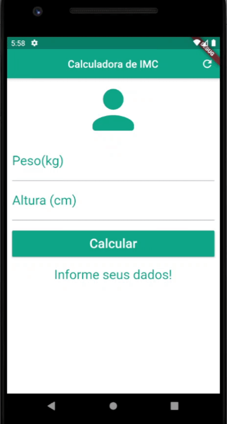

# App Calculadora de IMC
_OBS: Este App pertence ao [Curso da Udemy de Flutter](https://www.udemy.com/share/101WimAEAYeFZXQn0J/), feito para fins didáticos._

App em Flutter para cálculo de IMC (Índice de Massa Corporal);

- [x] Campos de peso e altura inseridos
- [x] Cálculo de IMC
  - [x] Cálculo com Classificação de acordo com IMC 
- [x] Validação de Form
  - [x] Campos Vazios
  - [ ] Se o campo é numérico  

## 📱 Screenshot (GIF)

